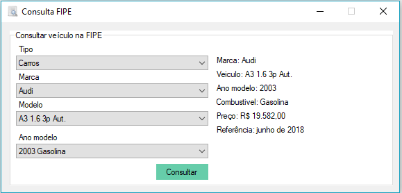

# Apresentação

Esta aplicação foi desenvolvida para oferecer as pessoas a possibilidade de consulta de veiculos direto na base da Fipe, de uma maneira facil e objetiva, bem como disponibilizar das dll para importação de desenvolvedores para integrar em seus sistemas.

# Requisitos

Para executar o programa é necessário:
* Ter Windows instalado, qualquer versão.
* Ter o Framework .Net 4.6 instalado.

# Instalação

Não há necessidade de instalação, basta executar o **ConsultaFIPE.exe**.
Para realizar debug e compilar, deve clonar o repositório ou baixar o código fonte em .zip.

# Como utilizar

**Para usuários**

Basta baixar o programa no tópico **Release** mais abaixo, descompactar em alguma pasta e rodar o ConsultaFIPE.exe. 

**Para desenvolvedores**

O código do projeto é liberado com o intuido a fomentar o opensource para tecnologia .NET, fica livre para ser clonado para aprender ou até sugerir melhorias e alterações no projeto. Algumas informações importantes:

* A solução foi desenvolvida no Framework 4.6, em Windows Forms.
* É utilizado o pacote Newtonsoft.Json pelo Nuget.
* É utilizado o pacote RestSharp pelo Nuget.

Se desejar incorpotar em seu projeto, pode usar as dll do arquivo dllParaImportar.rar, descompactar e referenciar as dll. Os pacotes Newtonsoft.Json e RestSharp podem ser instalados em seu projeto pelo Nuget, pegando assim a ultima versão disponivel, não é necessario importar estas dll, apenas WebServiceFIPE.dll. 

# Imagens do programa

# Pacotes de terceiro

* Newtonsoft.Json Versão: 11.0.2
* RestSharp Versão: 106.3.1

# Release

A versão Release do programa, executável com suas dependencias, basta descompactar e executar, pode ser baixado no link abaixo:

Atenção, aqui é para aqueles que apenas querem utilizar o programa...

[Consulta Fipe](https://github.com/ezequielsd/ConsultaFipe/raw/master/Release/Aplicativo.rar)

# Para Desenvolvedores

Se desejar basta importar as dll para seu projeto baixando o arquivo:

[dlls](https://github.com/ezequielsd/ConsultaFipe/raw/master/Release/dllParaImportar.rar)

# Autor

Ezequiel da Silva Daniel  
[Blog](https://ezequieldaniel.wordpress.com/)  
[Email](ezequielsd@gmail.com)

# Licença

[MIT]

